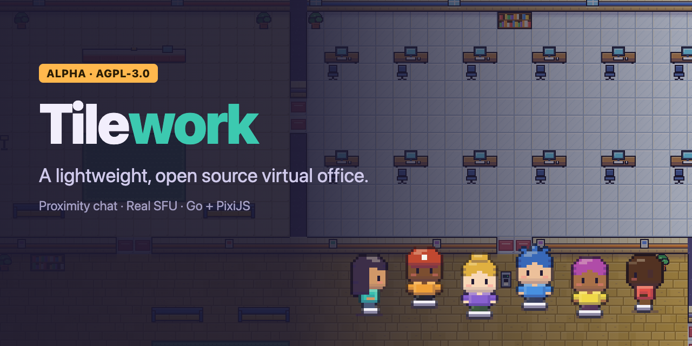
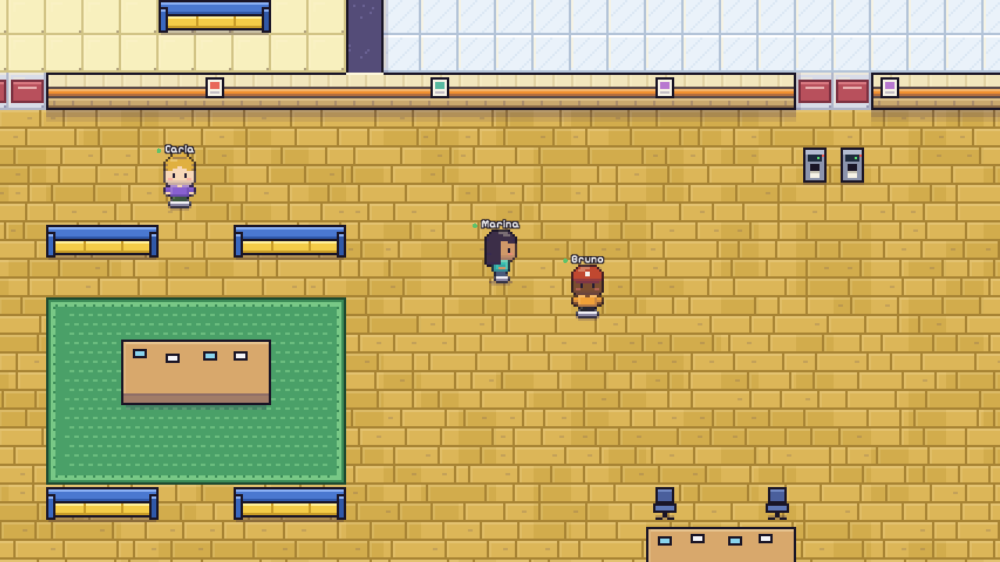
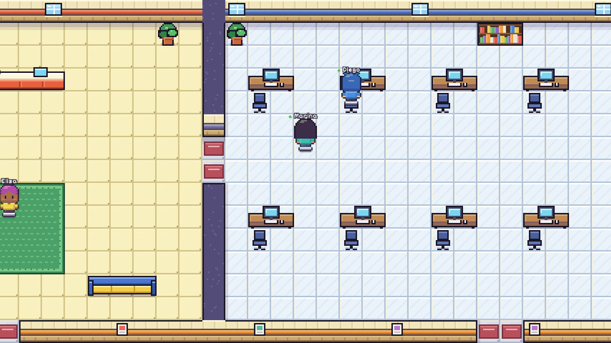
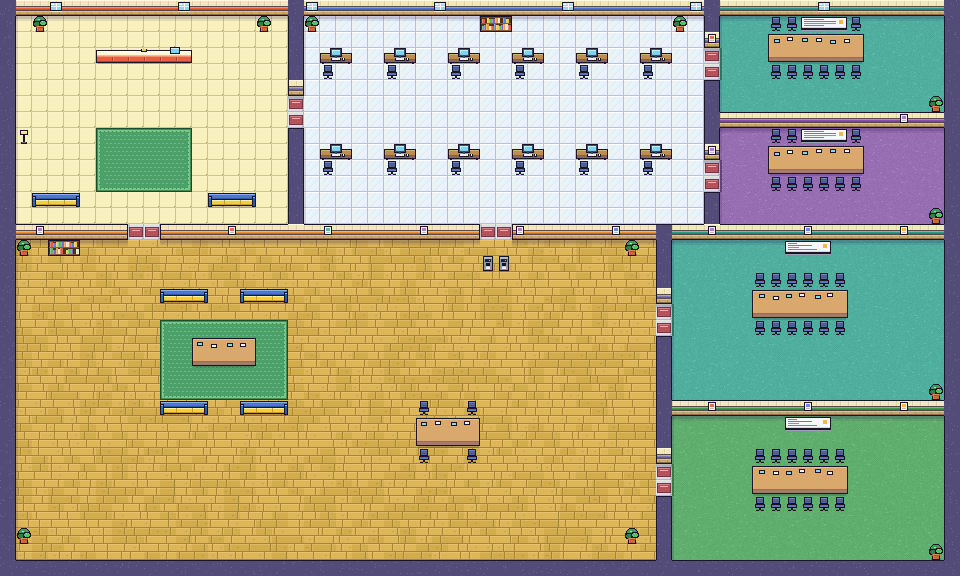
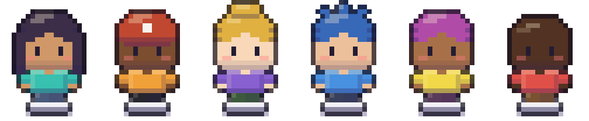
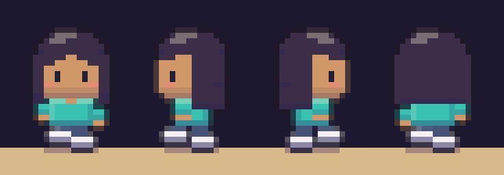

  

  
  
  
  
  

<h1 align="center">Open Gather</h1>

  <b>A lightweight, open source 2D virtual office.</b> 
  Walk around a pixel-art map, meet your team and talk by proximity, without burning CPU, RAM, GPU or bandwidth.

  <a href="https://guhcostan.github.io/open-gather/">Website</a> ·
  <a href="https://guhcostan.github.io/open-gather/docs/">Docs</a> ·
  <a href="#quick-start">Quick start</a> ·
  <a href="#status">Status</a> ·
  <a href="#contributing">Contributing</a>

> **MVP / alpha.** The whole loop works and is tested in real browsers: avatars, movement, proximity audio and video through a real SFU, private meeting rooms, screen sharing, chat, invites, an admin map editor and a Docker install. **Capacity on a real server has not been measured yet**: the load numbers we have come from a laptop with the generator on the same machine. Read [Status](#status) before you rely on anything. "Open Gather" is a **provisional name** and the project is not affiliated with the original Gather product.

## Why Open Gather

Virtual offices are usually heavy on the browser, the server and the bill. Open Gather is built around an efficiency budget:

- **A world server that does less work.** One Go goroutine owns each office. A spatial grid and areas of interest mean a player is only ever compared with the people near them, updates are batched at 10-15 Hz, and because walking is deterministic the server sends *state changes* instead of a position stream (about 5x less traffic than the first version in our local runs, see [decision 0006](docs/decisions/0006-state-change-records.md)).
- **Slow clients cannot hurt fast ones.** Queues are bounded; stale positions are overwritten while chat and control messages are kept.
- **A frugal browser client.** The whole static map is baked into one texture, only what the camera sees is drawn, hidden tabs stop rendering (calls keep running) and there is an economy mode.
- **Real media infrastructure, used sparingly.** Audio and video go through a self-hosted [LiveKit](https://livekit.io) SFU. Rooms are small and created on demand, tokens are scoped to a single room and access is revoked on the server when you leave.

  
  
   In-game screenshots (UI hidden). The look is an original take on a 2000s handheld-RPG style, see <a href="docs/art-style.md">Art style</a>.

  
   The starter office: reception, individual desks, four meeting rooms with different access rules and a social area. This image is baked by the game itself.

## Features

| | |
| --- | --- |
| **Avatars** | Procedural pixel-art characters with big heads and a three-frame walk cycle: skin, six hairstyles, hair colour, shirt, trousers. |
| **Look** | 16 px tiles, outlined and shaded props, textured floors and walls, dialog-window UI and a pixel font. All original. |
| **World** | Keyboard movement with collisions, camera follow, animation, prediction for you and dead-reckoned movement for others. |
| **Proximity conversations** | Audio and video start when you get close and stop when you leave, with hysteresis and small groups. |
| **Consent and status** | Nothing is captured before you opt in. Available, busy, away and invisible; busy never joins a call automatically. |
| **Meeting rooms** | Map areas with explicit access rules (open, members, admins, list) enforced by the server. |
| **Chat** | Office (last messages are kept), conversation and direct messages (never stored). |
| **Invites and roles** | Administrators mint invite links; members and administrators; production joins require an invite. |
| **Office editor** | Administrators paint walls, place objects, draw meeting rooms with access rules and assign desks; changes go live for everyone and persist. |
| **Profile** | Change your name and avatar any time. |
| **Screen sharing** | Inside a live conversation. |
| **Self-hosted** | One Go binary, SQLite in WAL mode, LiveKit. No paid service required. |

   
  

## Quick start

You need **Go**, **Node.js with pnpm** and a **LiveKit server** binary (on macOS: `brew install livekit`).

~~~bash
git clone https://github.com/guhcostan/open-gather.git
cd open-gather
./scripts/dev.sh
~~~

Then open http://127.0.0.1:5173 in **two different browser profiles**, pick a name and avatar, walk toward each other and enable audio and video when asked.

> The dev stack uses LiveKit's public development keys and an unauthenticated join endpoint. It is for local use only. Production mode refuses to start with those defaults.

Or with Docker (local evaluation only): `docker compose -f deploy/docker-compose.local.yml up --build` and open http://localhost:8080.

Tests:

~~~bash
cd server && go test -race ./...      # world simulation, store, media
cd web && pnpm exec tsc --noEmit      # type-check the client
cd e2e && pnpm install && node run.mjs   # real Chrome + real LiveKit, own server and database
~~~

Production install (HTTPS, invites, backups): [deploy/README.md](deploy/README.md).

More in the [getting started guide](docs/getting-started.md), including every environment variable.

## Architecture

~~~mermaid
flowchart LR
  subgraph Browser
    UI[React UI]
    W[PixiJS world]
    LK[LiveKit client]
  end
  subgraph Server[Go server]
    WORLD[Authoritative world spatial grid + interest areas]
    TOK[Token issuer]
  end
  DB[(SQLite WAL)]
  SFU[LiveKit SFU]
  UI --- W
  W <-- WebSocket --> WORLD
  WORLD --> DB
  WORLD --> TOK
  TOK -. scoped tokens / remove user .-> SFU
  LK <-- WebRTC --> SFU
~~~

World state, durable data and media transport are deliberately separate, so the media server can move to its own host and offices can be spread across instances later. Details: [architecture](docs/architecture.md) and the [decision records](docs/decisions/).

## Status

Last updated 2026-09-29. Everything below was executed on macOS (Apple M1 Pro), Go 1.26.5, Google Chrome with fake camera and microphone, LiveKit 1.13.7. Details and the exact counts: [Status](docs/status.md).

| Area | State |
| --- | --- |
| Go tests (world rules, proximity groups, dead reckoning, map reload, store, media tokens and reconciliation), also with the race detector | **pass** |
| Real-browser suite (Chrome + real LiveKit): proximity calls with real audio/video RTP, consent and busy, private rooms, screen share, invites and admin-only actions, map editor, chat and profile, token replay/tamper/expiry attacks, reconnection and restart persistence | **pass** |
| Docker: image builds, Compose local stack passes the browser scenarios, production mode in the container refuses insecure config and requires invites | **verified locally**; the production Compose file with Caddy/TLS/TURN on a public host is **not tested** |
| Load, scenario A (no media, up to 1,000 bots) and a 500-client mass reconnect | **run locally, generator on the same host**: not a capacity claim, see [results](docs/benchmark-results.md) |
| Media through a real SFU with synthetic Opus/VP8 (scenarios B and D, a scaled C): clean up to 40 people in calls, 20-person meeting with 6-video cap and a screen share, all 0 % loss | **run locally, generator on the same laptop**; full-size C (100 people) attempted and **invalid** on one machine |
| TURN through restrictive networks, two-hour soak (a 10-minute presence soak was run), browser FPS on the *reference* laptop (an M1 Pro reaches 60 FPS with 300 bots around), the 2 vCPU / 4 GB reference server | **not run** |
| Cost numbers | **formula only** ([bench/cost.py](bench/cost.py)); no prices verified |

### Targets we want to validate

Remote movement latency p95 below 150 ms (locally about 65 ms on loopback; not yet measured across a network), about 60 FPS on a laptop with integrated graphics (30 FPS or better in economy mode) and no unexplained memory growth. See [Efficiency and benchmarks](docs/efficiency-and-benchmarks.md).

## Repository layout

~~~text
server/   Go: HTTP + WebSocket, authoritative world, SQLite, LiveKit integration, load generator
web/      TypeScript + React + Vite + PixiJS client
e2e/      real-browser end-to-end tests and art generation
bench/    benchmark scripts, raw results and the cost model
deploy/   Dockerfile, Compose files (local and production), Caddyfile
site/     landing page and docs site (GitHub Pages)
docs/     documentation sources and architecture decision records
scripts/  local development stack
~~~

## Contributing

Issues, careful bug reports, tests and measurements are all welcome. Read [CONTRIBUTING](docs/contributing.md) and [AGENTS.md](AGENTS.md) (also useful for humans) first. Everything in the repository is written in **English**.

## Licence and credits

- Code: **AGPL-3.0** ([LICENSE](LICENSE)), with no additional restrictions on commercial use.
- Sprites, map, UI frames and site art are drawn by this project's own code (`web/src/game/art`, `e2e/art.mjs`); no third-party art, and no Gather, Nintendo or Game Freak assets, are used. The style is inspired by 2000s handheld RPGs, nothing is copied ([details](docs/art-style.md)).
- Font: [Pixelify Sans](https://github.com/eifetx/Pixelify-Sans), SIL Open Font License 1.1 (`web/src/assets/fonts`).
- Built on open source: [Go](https://go.dev), [coder/websocket](https://github.com/coder/websocket), [modernc.org/sqlite](https://gitlab.com/cznic/sqlite), [React](https://react.dev), [Vite](https://vite.dev), [PixiJS](https://pixijs.com), [LiveKit](https://livekit.io) and [marked](https://marked.js.org). The third-party licence inventory is in [THIRD_PARTY_LICENSES.md](THIRD_PARTY_LICENSES.md).
